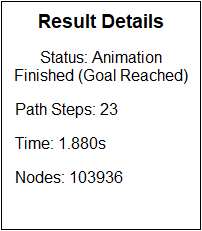

# Ứng dụng Giải Câu đố 8 Ô Chữ (8-Puzzle Solver) và Trực Quan Hóa Thuật Toán Tìm kiếm AI

Đây là một ứng dụng GUI (Giao diện người dùng) được xây dựng bằng Tkinter trong Python, cho phép người dùng trực quan hóa quá trình giải câu đố 8 ô chữ (8-Puzzle) bằng nhiều thuật toán tìm kiếm Trí tuệ Nhân tạo (AI) khác nhau.

## Mục tiêu

Mục tiêu chính của dự án là:

1.  **Trực quan hóa** cách các thuật toán tìm kiếm khác nhau hoạt động để giải 8-Puzzle.
2.  Giúp **hiểu rõ hơn** các khái niệm về không gian trạng thái, không gian niềm tin, hàm heuristic và cách các thuật toán duyệt qua không gian đó.
3.  Cung cấp một công cụ để **so sánh hiệu suất** (thời gian, số nút/trạng thái đã duyệt, độ dài đường đi) của các thuật toán trên các bài toán cụ thể.

## Nội dung

Dự án bao gồm:

*   Cài đặt câu đố 8 ô chữ và các thao tác cơ bản (tìm ô trống, lấy hàng xóm).
*   Triển khai nhiều thuật toán tìm kiếm AI từ các nhóm khác nhau.
*   Giao diện người dùng Tkinter để hiển thị trạng thái ban đầu, trạng thái đích, trạng thái hiện tại trong quá trình giải và các thông tin hiệu suất.
*   Chức năng minh họa (animation) quá trình giải theo đường đi tìm được bởi thuật toán.

### 2.1. Các thuật toán Tìm kiếm không có thông tin (Uninformed Search)

Nhóm thuật toán này tìm kiếm lời giải mà **không sử dụng bất kỳ thông tin bổ sung nào** về "khoảng cách" hoặc "chi phí ước lượng" từ trạng thái hiện tại đến trạng thái đích. Chúng chỉ dựa vào cấu trúc của không gian tìm kiếm (các trạng thái và các kết nối giữa chúng).

*   **Các thành phần chính của bài toán tìm kiếm:**
    *   **Trạng thái (State):** Một cấu hình cụ thể của bàn cờ 8 ô chữ.
    *   **Trạng thái bắt đầu (Initial State):** [[2, 6, 5], [0, 8, 7], [4, 3, 1]].
    *   **Trạng thái đích (Goal State):** [[1, 2, 3], [4, 5, 6], [7, 8, 0]].
    *   **Các hành động/Phép toán (Actions/Operators):** Các di chuyển hợp lệ của ô trống (lên, xuống, trái, phải).
    *   **Mô hình chuyển đổi (Transition Model):** Mô tả trạng thái mới sẽ như thế nào sau khi thực hiện một hành động từ trạng thái hiện tại.
    *   **Chi phí đường đi (Path Cost):** Chi phí tích lũy của chuỗi hành động từ trạng thái bắt đầu đến trạng thái hiện tại.
    *   **Lời giải (Solution):** Một chuỗi các hành động từ trạng thái bắt đầu đến trạng thái đích. Một lời giải tối ưu là lời giải có tổng chi phí đường đi thấp nhất.

*   **Các thuật toán trong nhóm này được triển khai:**
    *   **BFS (Breadth-First Search):** Tìm kiếm theo chiều rộng. Duyệt qua không gian trạng thái theo từng lớp độ sâu. Đảm bảo tính đầy đủ và tối ưu trên đồ thị này.
    
    *   **DFS (Depth-First Search):** Tìm kiếm theo chiều sâu. Duyệt xuống sâu nhất có thể trước khi quay lui. Triển khai có sử dụng `visited` set để tránh lặp vô hạn.
    *   **(số bước giải rất lớn, thời gian giải lâu nên phần này em không có gif)
    *   **UCS (Uniform Cost Search):** Tìm kiếm chi phí đồng nhất. Mở rộng nút có chi phí đường đi thấp nhất. Đảm bảo tính đầy đủ và tối ưu.
    
    *   **IDS (Iterative Deepening Search):** Tìm kiếm tăng dần độ sâu. Thực hiện DLS (Depth-Limited Search) lặp đi lặp lại với giới hạn độ sâu tăng dần. Triển khai theo cách lặp tường minh để tránh giới hạn đệ quy Python. Đảm bảo tính đầy đủ và tối ưu.
    

*   **Hình ảnh so sánh hiệu suất:**
    *   **BFS (Breadth-First Search):
    

    *   **DFS (Depth-First Search):
    

    *   **UCS (Uniform Cost Search)
    

    *   **IDS (Iterative Deepening Search)
    

*   **Bảng so sánh:**

    | Thuật toán | Độ dài đường đi (Path Steps)| Số nút đã duyệt (Nodes)  | Thời gian (Time)|
    |------------|-----------------------------|--------------------------|-----------------|
    | BFS        | 23                          | 115372                   | 1.297s          |
    | DFS        | 7113                        | 7297                     | 0.604s          |
    | UCS        | 23                          | 103936                   | 1.880s          |
    | IDS        | 23                          | 659337                   | 6.926s          |

*   **Nhận xét về hiệu suất trong nhóm này khi áp dụng lên 8 ô chữ:**
    *   Về Độ dài đường đi (Path Steps):
        *   BFS, UCS, và IDS tìm thấy đường đi có độ dài 23 bước.
        *   DFS tìm thấy đường đi có độ dài 7113 bước.
    *   Về Số nút đã duyệt (Nodes):
        *   DFS duyệt ít nút nhất (7297 nút).
        *   UCS duyệt ít nút hơn BFS (103936 so với 115372 nút).
        *   IDS duyệt nhiều nút nhất (659337 nút).
    *   Về Thời gian tìm được giải pháp (Time):
        *   DFS là thuật toán nhanh nhất (0.604 giây).
        *   BFS (1.297 giây) nhanh hơn UCS (1.880 giây).
        *   IDS là thuật toán chậm nhất (6.926 giây).
    *   Nhận xét tổng hợp: BFS, UCS và IDS tìm thấy đường đi tối ưu (23 bước). DFS tìm đường đi không tối ưu (7113 bước). DFS là nhanh nhất và duyệt ít nút nhất trong trường hợp này, trong khi IDS là chậm nhất và duyệt nhiều nút nhất.

### 2.2. Các thuật toán Tìm kiếm có thông tin (Informed Search)

Nhóm thuật toán này sử dụng **thông tin bổ sung** (thường là hàm heuristic - hàm ước lượng chi phí từ trạng thái hiện tại đến đích) để hướng dẫn quá trình tìm kiếm, nhằm tìm lời giải hiệu quả hơn so với các thuật toán không có thông tin.

*   **Các thành phần chính của bài toán tìm kiếm:**
    *   **Trạng thái (State):** Một cấu hình cụ thể của bàn cờ 8 ô chữ.
    *   **Trạng thái bắt đầu (Initial State):** [[2, 6, 5], [0, 8, 7], [4, 3, 1]].
    *   **Trạng thái đích (Goal State):** [[1, 2, 3], [4, 5, 6], [7, 8, 0]].
    *   **Các hành động/Phép toán (Actions/Operators):** Các di chuyển hợp lệ của ô trống (lên, xuống, trái, phải).
    *   **Mô hình chuyển đổi (Transition Model):** Mô tả trạng thái mới sẽ như thế nào sau khi thực hiện một hành động từ trạng thái hiện tại.
    *   **Chi phí đường đi (Path Cost):** Chi phí tích lũy của chuỗi hành động từ trạng thái bắt đầu đến trạng thái hiện tại (thường là 1 cho mỗi bước di chuyển ô trống trong 8-Puzzle).
    *   **Lời giải (Solution):** Một chuỗi các hành động từ trạng thái bắt đầu đến trạng thái đích. Một lời giải tối ưu là lời giải có tổng chi phí đường đi thấp nhất.
    *   **Hàm Heuristic được sử dụng:** Khoảng cách Manhattan (Manhattan Distance) - Tính tổng khoảng cách (số bước ngang + dọc) từ vị trí hiện tại của mỗi ô (không tính ô 0) đến vị trí đích của nó. Đây là một heuristic chấp nhận được (admissible) và nhất quán (consistent) cho 8-Puzzle.

*   **Các thuật toán trong nhóm này được triển khai:**
    *   **A\* (A-Star Search):** Mở rộng nút có chi phí ước lượng thấp nhất (`f(n) = g(n) + h(n)`). Với heuristic Manhattan, A\* là đầy đủ và tối ưu.
    
    *   **Greedy Best-First Search:** Mở rộng nút có chi phí ước lượng đến đích thấp nhất (`h(n)`). Thường nhanh nhưng không đảm bảo tính tối ưu hoặc đầy đủ.
    
    *   **IDA\* (Iterative Deepening A\*):** Kết hợp tăng dần giới hạn (như IDS) với hàm heuristic (như A\*). Hiệu quả về bộ nhớ và đảm bảo tính đầy đủ/tối ưu với heuristic Manhattan.
    

*   **Hình ảnh so sánh hiệu suất:**
    *   **A\* (A-Star Search):
    

    *   **Greedy Best-First Search:
    

    *   IDA\* (Iterative Deepening A\*):
    

*   **Bảng so sánh:**

    | Thuật toán                | Độ dài đường đi (Path Steps)| Số nút đã duyệt (Nodes)  | Thời gian (Time) |
    |---------------------------|-----------------------------|--------------------------|------------------|
    | A\*                       | 23                          | 1023                     | 0.013s           |
    | IDA\*                     | 23                          | 3209                     | 0.023s           |
    | Greedy Best-First Search  | 79                          | 455                      | 0.007s           |
   
*   **Nhận xét về hiệu suất trong nhóm này khi áp dụng lên 8 ô chữ:**

    *   Về Độ dài đường đi (Path Steps):
        *   A* và IDA* tìm thấy đường đi có độ dài 23 bước. Đây là độ dài tối ưu cho bài toán này.
        *   Greedy Best-First Search tìm đường đi có độ dài 79 bước.
    *   Về Số nút đã duyệt (Nodes):
        *   Greedy Best-First Search duyệt ít nút nhất (455 nút).
        *   A* duyệt số nút trung bình (1023 nút).
        *   IDA* duyệt nhiều nút nhất (3209 nút).
    *   Về Thời gian tìm được giải pháp (Time):
        *   Greedy Best-First Search là nhanh nhất (0.007s).
        *   A* là nhanh thứ hai (0.013s).
        *   IDA* chậm hơn A* một chút (0.023s).
    *   Nhận xét tổng hợp:
        *   A* và IDA* tìm thấy lời giải tối ưu. Greedy Best-First Search không đảm bảo tính tối ưu.
        *   Greedy Best-First Search hiệu quả nhất về thời gian và số nút duyệt trong trường hợp này.

### 2.3. Các thuật toán Tìm kiếm cục bộ (Local Search)

Các thuật toán này thường chỉ duy trì một hoặc một vài trạng thái hiện tại và di chuyển đến các trạng thái lân cận dựa trên một tiêu chí (thường là cải thiện giá trị mục tiêu/heuristic). Chúng không ghi nhớ đường đi đầy đủ từ điểm bắt đầu và có thể mắc kẹt ở cực tiểu cục bộ hoặc không tìm thấy lời giải.

*   **Các thành phần chính của bài toán tìm kiếm:**
    *   **Trạng thái (State):** Một cấu hình cụ thể của bàn cờ 8 ô chữ.
    *   **Trạng thái bắt đầu (Initial State):** [[0, 1, 2], [4, 5, 3], [7, 8, 6]].
    *   **Trạng thái đích (Goal State):** [[1, 2, 3], [4, 5, 6], [7, 8, 0]].
    *   **Các hành động/Phép toán (Actions/Operators):** Các di chuyển hợp lệ của ô trống (lên, xuống, trái, phải).
    *   **Mô hình chuyển đổi (Transition Model):** Mô tả trạng thái mới sẽ như thế nào sau khi thực hiện một hành động từ trạng thái hiện tại.
    *   **Chi phí đường đi (Path Cost):** Chi phí tích lũy của chuỗi hành động từ trạng thái bắt đầu đến trạng thái hiện tại (thường là 1 cho mỗi bước di chuyển ô trống trong 8-Puzzle).
    *   **Lời giải (Solution):** Một chuỗi các hành động từ trạng thái bắt đầu đến trạng thái đích. Một lời giải tối ưu là lời giải có tổng chi phí đường đi thấp nhất.

*   **Các thuật toán trong nhóm này được triển khai:**
    *   **Simple Hill Climbing:** Di chuyển đến hàng xóm đầu tiên tốt hơn trạng thái hiện tại.
    *   **Steepest Ascent Hill Climbing:** Di chuyển đến hàng xóm tốt nhất trong tất cả các hàng xóm của trạng thái hiện tại.
    *   **Stochastic Hill Climbing:** Chọn ngẫu nhiên một hàng xóm tốt hơn từ danh sách các hàng xóm tốt hơn.
    *   Gif dùng chung cho 3 thuật toán Hill Climbing
    
    *   **Simulated Annealing (SA):** Tương tự Hill Climbing nhưng cho phép di chuyển đến trạng thái xấu hơn theo xác suất (giảm dần theo thời gian) để thoát khỏi cực tiểu cục bộ.
    *   **(số bước giải rất lớn, thời gian giải lâu nên phần này em không có gif)
    *   **Beam Search:** Duy trì một tập hợp (chùm) các trạng thái tốt nhất hiện tại (dựa trên heuristic) và mở rộng chúng ở mỗi bước, sau đó chỉ giữ lại những trạng thái tốt nhất từ các trạng thái mới sinh ra.
    

    *   **Genetic algorithm (GA):** Một phương pháp để giải quyết cả bài toán tối ưu hóa có ràng buộc và không ràng buộc dựa trên chọn lọc tự nhiên.
    

*   **Hình ảnh so sánh hiệu suất:**
    *   **Simple Hill Climbing:
    

    *   **Steepest Ascent Hill Climbing:
    

    *   **Stochastic Hill Climbing:
    

    *   **Simulated Annealing (SA):
    

    *   **Beam Search:
    

    *   **Genetic Algorithm: 
    

*   **Bảng so sánh:**

    | Thuật toán                     | Độ dài đường đi (Path Steps)| Số nút đã duyệt (Nodes) | Thời gian (Time)|
    |--------------------------------|-----------------------------|-------------------------|-----------------|
    | Simple Hill Climbing           | 4                           | 4                       | 0.000s          |
    | Steepest Ascent Hill Climbing  | 4                           | 4                       | 0.001s          | 
    | Stochastic Hill Climbing       | 4                           | 4                       | 0.001s          |
    | Simulated Annealing            | 23962                       | 24510                   | 0.286s          |
    | Beam Search                    | 4                           | 12                      | 0.000s          |
    | Genetic Algorithm              | 4                           | 1128                    | 0.074s          |

*   **Nhận xét về hiệu suất trong nhóm này khi áp dụng lên 8 ô chữ:**

    *   Về Độ dài đường đi (Path Steps):
        *   Simple HC, Steepest HC, Stochastic HC, và Beam Search tìm thấy đường đi có độ dài 4 bước.
        *   Genetic algorithm tìm thấy đường đi có độ dài 4 bước.
        *   Simulated Annealing tìm đường đi có độ dài 23962 bước.
    *   Về Số nút đã duyệt (Nodes):
        *   Simple HC, Steepest HC, và Stochastic HC duyệt ít nút nhất (4 nút).
        *   Beam Search duyệt số nút trung bình (12 nút).
        *   Genetic algorithm duyệt số nút khá nhiều (1128 nút).
        *   Simulated Annealing duyệt nhiều nút nhất (24510 nút).
    *   Về Thời gian tìm được giải pháp (Time):
        *   Simple HC và Beam Search có Thời gian tìm được giải pháp nhanh nhất (0.000s).
        *   Steepest HC và Stochastic HC cũng rất nhanh (0.001s).
        *   Genetic algorithm tương đối nhanh (0.074s).
        *   Simulated Annealing có Thời gian tìm được giải pháp chậm nhất trong nhóm này (0.286s).
    *   Nhận xét tổng hợp: 
        *   Simple HC, Steepest HC, Stochastic HC, Genetic algorithm và Beam Search tìm thấy đường đi ngắn nhất (4 bước). Simulated Annealing tìm đường đi dài hơn đáng kể.
        *   Các thuật toán Hill Climbing (Simple, Steepest, Stochastic), Genetic algorithm và Beam Search thể hiện hiệu suất cao về thời gian và số nút duyệt trong trường hợp này.
        *   Simulated Annealing khám phá một không gian lớn hơn và có Thời gian tìm được giải pháp cao hơn.

### 2.4. Các thuật toán Tìm kiếm trong môi trường phức tạp

Nhóm này bao gồm các thuật toán tìm kiếm hoạt động trong các trạng thái mà agent không có đầy đủ thông tin.

#### 2.4.1. Tìm kiếm trên môi trường niềm tin (Belief Space Search / Sensorless Search)

Đây là nhóm thuật toán giải quyết các bài toán khi agent không biết chính xác trạng thái của mình, mà chỉ duy trì một tập hợp các trạng thái có thể (tập hợp niềm tin). Mục tiêu là tìm một chuỗi hành động đảm bảo đạt được trạng thái đích bất kể trạng thái ban đầu là gì (miễn là nó thuộc vào tập hợp niềm tin ban đầu). Các hành động được áp dụng cho toàn bộ tập hợp niềm tin.

*   **Các thành phần chính:**
    *   **Trạng thái niềm tin (Belief State):** Một tập hợp các trạng thái có thể của bàn cờ 8 ô chữ.
    *   **Trạng thái niềm tin ban đầu:** [[1, 2, 3], [4, 0, 5], [6, 7, 8]].
    *   **Trạng thái đích (Goal State):** [[1, 2, 3], [4, 5, 6], [7, 8, 0]].
    *   **Hành động:** Một hành động được coi là khả thi trên không gian niềm tin nếu nó khả thi ở **tất cả** các trạng thái  trong tập hợp niềm tin hiện tại.
    *   **Mô hình chuyển đổi niềm tin:** Từ tập hợp niềm tin hiện tại, xác định tập hợp niềm tin mới bao gồm tất cả các trạng thái có thể đạt được.
    *   **Lời giải:** Một chuỗi hành động sao cho khi thực hiện chuỗi hành động này, tập hợp niềm tin cuối cùng chỉ chứa trạng thái đích.

*   **Các thuật toán trong nhóm này được triển khai:**

    *   **a. No Observation (Không quan sát được - triển khai bằng BFS):**
        *   **Mô tả:** Không nhận được bất kỳ thông tin phản hồi hay quan sát nào trong suốt quá trình thực hiện kế hoạch. Thuật toán phải tìm một kế hoạch đảm bảo đạt đích mà không cần biết mình đang ở trạng thái cụ thể nào sau mỗi bước đi. Triển khai sử dụng BFS trên không gian niềm tin để tìm kế hoạch ngắn nhất.
        

    *   **b. Partially Observation (Quan sát được một phần - triển khai bằng BFS):**
        *   **Mô tả ý tưởng:** Nhận được quan sát sau mỗi bước đi. Quan sát này có thể giúp lọc và thu hẹp tập hợp niềm tin, giảm bớt sự không chắc chắn.
        

*   **Hình ảnh so sánh hiệu suất:**
    *   No Observation (Không quan sát được):
    

    *   Partially Observation (Quan sát được một phần):
    

*   **Bảng so sánh:**
    | Thuật toán                  | Độ dài kế hoạch (Plan Actions)| Số tập hợp niềm tin (Belief States)| Thời gian (Time) |
    |-----------------------------|-------------------------------|------------------------------------|------------------|
    |No Observation - BFS         | 14                            | 6413                               | 13.775s          |
    |Partially Observation - BFS  | 14                            | 6413                               | 6.117s           |

*   **Nhận xét về hiệu suất trong nhóm này khi áp dụng lên 8 ô chữ:**

    *   Về Độ dài đường đi (Path Steps):
        *   No Observation và Partially Observation đều thực hiện 14 bước.
    *   Về Số các trạng thái đã tìm được:
        *   No Observation và Partially Observation đều thực hiện duyệt qua 6413 trạng thái.
    *   Về Thời gian tìm được trạng thái niềm tin phù hợp (Time):
        *   No Observation có thời gian tìm kiếm là 13.775s.
        *   Partially Observation có thời gian tìm kiếm nhanh hơn, là 6.117s.
    *   Nhận xét tổng hợp:
        *   Kích thước không gian niềm tin rất lớn, tìm kiếm trạng thái rất mất thời gian.
        *   Partially Observation có thêm sự hỗ trợ của các hàm lọc trạng thái và qua sát nên tốc độ tìm kiếm nhanh hơn No Observation.

    

#### 2.4.2. AND/OR Search (AOSerach)

Đây là một thuật toán tìm kiếm thử nghiệm được triển khai dựa trên logic AND/OR như đã thảo luận, áp dụng trực tiếp lên **không gian trạng thái vật lý**.

*   **Mô tả logic:**
    *   Thuật toán duyệt qua không gian trạng thái bằng cách xen kẽ giữa các nút "OR" và nút "AND" theo độ sâu.
    *   Nút OR: Thành công nếu *một trong* các nhánh con (hàng xóm) dẫn đến lời giải.
    *   Nút AND: Thành công nếu *tất cả* các nhánh con (hàng xóm) dẫn đến lời giải.
    *   Sử dụng cơ chế ngăn chặn chu trình trong đường đi khám phá hiện tại.

*   **Các thành phần chính của bài toán tìm kiếm:**
    *   **Trạng thái (State):** Một cấu hình cụ thể của bàn cờ 8 ô chữ.
    *   **Trạng thái bắt đầu (Initial State):** [[1, 2, 3], [4, 5, 6], [7, 0, 8]].
    *   **Trạng thái đích (Goal State):** [[1, 2, 3], [4, 5, 6], [7, 8, 0]].
    *   **Các hành động/Phép toán (Actions/Operators):** Các di chuyển hợp lệ của ô trống (lên, xuống, trái, phải).
    *   **Mô hình chuyển đổi (Transition Model): Mô tả cách một hành động cụ thể làm thay đổi trạng thái hiện tại để tạo ra trạng thái mới (được thực hiện bởi hàm apply_action và get_successors).
    *   **Lời giải (Solution):** Một chuỗi các hành động từ trạng thái bắt đầu đến trạng thái đích.

*   **Hình ảnh gif của thuật toán:**
    

*   **Hình ảnh hiệu suất:**
    

*   **Nhận xét về hiệu suất khi áp dụng lên 8 ô chữ:**
    *   Do bản chất của logic AND và cách xây dựng đường đi của nó không phù hợp với cấu trúc bài toán 8-Puzzle, thuật toán này sẽ **không tìm thấy lời giải hợp lý và tối ưu** cho các bài toán 8-Puzzle thông thường, chỉ tìm được lời giải cho trạng thái đơn giản như [[1, 2, 3], [4, 5, 6], [7, 0, 8]] .

### 2.5. Các Thuật toán Tìm kiếm Có ràng buộc (Constraint Satisfaction Problems - CSP)

Trong bài toán CSP, mục tiêu là tìm một gán giá trị cho một tập hợp các biến sao cho tất cả các ràng buộc giữa các biến được thỏa mãn. Bài toán CSP: **Điền các số từ 0 đến 8 vào ma trận 3x3, mỗi số một lần, sao cho thỏa mãn các ràng buộc.

*   **Các thành phần chính của bài toán CSP:**
    *   **Biến:** 9 ô trên bàn cờ 3x3.
    *   **Miền giá trị:** Tập hợp các số {0, 1, 2, 3, 4, 5, 6, 7, 8} cho mỗi ô.
    *   **Ràng buộc:**
        *   **Ràng buộc duy nhất:** Mỗi số từ 0 đến 8 phải xuất hiện đúng một lần trên bàn cờ.
        *   **Ràng buộc lân cận:** Đối với các ô lân cận (trên/dưới, trái/phải), giá trị của các số phải thỏa mãn một mối quan hệ (trị tuyệt đối hiệu giữa giá trị ô hiện tại và ô bên trái không bằng 1; trị tuyệt đối hiệu giữa giá trị ô hiện tại và ô phía trên không bằng 3). Số 0 (ô trống) có thể được miễn trừ khỏi một số ràng buộc lân cận.

*   **Các thuật toán CSP được triển khai:**

    *   **Backtracking:** Đây là một thuật toán tìm kiếm theo chiều sâu để giải CSP. Nó gán giá trị cho từng biến (ô) một cách tăng dần. Tại mỗi bước, nó thử gán một giá trị từ miền giá trị cho ô hiện tại. Nếu việc gán đó vi phạm bất kỳ ràng buộc nào với các ô đã điền trước đó, nó sẽ quay lui (backtrack) và thử giá trị khác. Nếu không có giá trị nào hoạt động cho ô hiện tại, nó quay lui về ô trước đó. Thuật toán dừng khi tìm thấy một gán đầy đủ cho tất cả các biến (điền đầy đủ ma trận) mà không vi phạm ràng buộc.
    

    *   **AC3 (Arc Consistency 3):** Phương pháp này kết hợp thuật toán duy trì tính nhất quán (AC3) với Backtracking. Đầu tiên, AC3 được chạy để thu hẹp miền giá trị của các biến bằng cách loại bỏ các giá trị không thể xuất hiện trong bất kỳ lời giải nào thỏa mãn ràng buộc. Sau khi AC3 hoàn tất, Backtrackin được sử dụng để tìm một lời giải cụ thể từ các miền giá trị đã bị thu hẹp.
    

    *   **Kiểm thử (Generate and Test):**  Thuật toán này hoạt động như một quy trình "Sinh và Kiểm tra", điền tăng dần (giống Backtracking Search) để xây dựng các cấu hình. Nếu điền xong và khớp với trạng thái đích, coi là tìm thấy lời giải. Ghi lại tất cả trạng thái trung gian trong quá trình điền/kiểm thử.

    

*   **Hình ảnh so sánh hiệu suất:**
    *   **Backtracking:
    

    *   **AC3 (Arc Consistency 3):
    

    *   **Kiểm thử (Generate and Test):
    

**Bảng so sánh:**

| Thuật toán         | Độ dài đường đi (Path Steps)| Số nút đã duyệt (Nodes) | Thời gian (Time)|
|--------------------|-----------------------------|-------------------------|-----------------|
| Backtracking       | 28                          | 29                      | 29.000          |
| AC3                | 8                           | 9                       | 9.000           |
| Generate and Test  | 278                         | 143                     | 0.035           |

*   **Nhận xét về hiệu suất trong nhóm này khi áp dụng lên 8 ô chữ:**

*  Về Độ dài đường đi (Path Steps):
    *   AC3 có 8 bước.
    *   Backtracking có 28 bước.
    *   Generate and Test có 278 bước.
    *   Ý nghĩa của "Path Steps" ở đây không phải là số bước di chuyển ô trống trong 8-Puzzle thông thường, mà là số bước trong quá trình điền/kiểm tra.

*  Về Số nút đã duyệt (Nodes):
    *   AC3 duyệt ít nút nhất (9 nút).
    *   Backtracking duyệt số nút trung bình (29 nút).
    *   Generate and Test duyệt nhiều nút nhất (143 nút).

*  Về Thời gian tìm được giải pháp (Time):
    *   Generate and Test là nhanh nhất (0.035s).
    *   AC3 (9.000s) và Backtracking (29.000s) chậm hơn đáng kể. Backtracking là chậm nhất.

**Nhận xét tổng hợp:**

*   Generate and Test thể hiện hiệu suất tốt nhất về thời gian trong lần chạy này.
*   AC3 và Backtracking có vẻ kém hiệu quả về thời gian so với Generate and Test cho bài toán cụ thể này, với Backtracking chậm nhất.
*   Số nút duyệt của AC3 là ít nhất và Generate and test là nhiều nhất.

### 2.6. Các thuật toán Tìm kiếm Học tăng cường (Reinforcement Learning Algorithms)

Học tăng cường, nơi một agent học cách hành động trong một môi trường để tối đa hóa tổng phần thưởng nhận được theo thời gian. Agent học thông qua tương tác (thử và sai) với môi trường, thực hiện các hành động và nhận phản hồi dưới dạng phần thưởng hoặc hình phạt.

*   **Các thành phần chính:**
    *   **Môi trường (Environment):** Bài toán 8 ô chữ.
    *   **Agent:** Bộ giải 8-Puzzle, học cách chọn hành động.
    *   **Trạng thái (State):** Một cấu hình cụ thể của bàn cờ 8 ô chữ.
    *   **Hành động (Action):** Một di chuyển hợp lệ của ô trống.
    *   **Chính sách (Policy):** Chiến lược mà agent sử dụng để chọn hành động trong một trạng thái cụ thể.
    *   **Phần thưởng (Reward):** Phản hồi nhận được từ môi trường sau khi thực hiện một hành động (ví dụ: phần thưởng lớn khi đạt đích, hình phạt khi di chuyển không hợp lệ hoặc di chuyển xa đích).
    *   **Hàm giá trị (Value Function):** Dự đoán tổng phần thưởng tương lai mà agent có thể nhận được từ một trạng thái hoặc một cặp (trạng thái, hành động).

*   **Thuật toán trong nhóm này được triển khai:**

    *   **Q-Learning:**
        *   **Mô tả:** Q-Learning là một thuật toán học tăng cường. Nó học một hàm giá trị hành động, gọi là Q-function (Q(s, a)), lưu trữ trong một bảng (Q-table). Q(s, a) ước tính tổng phần thưởng tương lai kỳ vọng khi thực hiện hành động `a` trong trạng thái `s` và sau đó đi theo chính sách tối ưu. Agent học Q-function thông qua thử và sai, cập nhật các giá trị trong Q-table dựa trên phần thưởng nhận được và giá trị Q ước tính của trạng thái tiếp theo.

        *   **Hình ảnh gif của thuật toán:**
        

        *   **Hình ảnh so sánh hiệu suất:**
        

        *   **Nhận xét về hiệu suất khi áp dụng lên 8 ô chữ:**
            *   Q-Learning là một thuật toán mạnh mẽ nhưng thường đòi hỏi một lượng lớn kinh nghiệm (nhiều episode và bước) để học được lời giải tốt cho các bài toán có không gian trạng thái lớn như 8-Puzzle, đặc biệt khi chỉ bắt đầu từ một trạng thái bắt đầu cố định.
            *   Hiệu quả phụ thuộc nhiều vào việc tinh chỉnh các tham số như `alpha`, `gamma`, `epsilon_decay`, `min_epsilon` và số lượng `episodes`.
            *   Đường đi trích xuất dựa trên Q-table đã học là đường đi theo chính sách tham lam tốt nhất mà agent tìm thấy, không nhất thiết là đường đi tối ưu toàn cục (như A*).
            *   Kích thước Q-table phản ánh số lượng các trạng thái-hành động mà agent đã ghé thăm và học được.

## 3. Kết luận

Qua quá trình xây dựng dự án, em đã đạt được một số kết quả đáng kể, giúp em hiểu sâu sắc hơn về các thuật toán tìm kiếm trong lĩnh vực trí tuệ nhân tạo.

*   **Phát triển ứng dụng GUI trực quan:** Em đã xây dựng một ứng dụng GUI đầy đủ chức năng bằng Tkinter. Ứng dụng này cho phép người dùng tương tác để:
    *   Chọn và chạy các thuật toán tìm kiếm.
    *   Xem trực tiếp trạng thái ban đầu, trạng thái đích và trạng thái hiện tại của bài toán.
    *   Quan sát quá trình giải câu đố 8 ô chữ một cách sinh động thông qua hoạt họa (animation).

*   **Triển khai đa dạng các thuật toán:** Em đã triển khai thành công các thuật toán tìm kiếm thuộc 6 nhóm chính:
    *   **Tìm kiếm Không có thông tin:** BFS, DFS, UCS, IDS.
    *   **Tìm kiếm Có thông tin:** A\*, Greedy Best-First, IDA*.
    *   **Tìm kiếm Cục bộ:** Simple Hill Climbing, Steepest Ascent Hill Climbing, Stochastic Hill Climbing, Simulated Annealing, Beam Search, Genetic Algorithm.
    *   **Tìm kiếm Trong môi trường phức tạp:** Search with no observation, Search with partially observation, AND/OR Search.
    *   **Tìm kiếm Có ràng buộc:** Backtracking, AC3, Kiểm thử (Generate and test).
    *   **Tìm kiếm Học tăng cường:** Q-Learning.

*   **Trực tiếp quan sát và hiểu thuật toán:** Việc được trực tiếp quan sát từng bước hoạt động của các thuật toán trên giao diện đã giúp em củng cố lý thuyết và có cái nhìn trực quan hơn về cách mà mỗi thuật toán khám phá không gian tìm kiếm.
*   **Thu thập và phân tích hiệu suất:** Em đã triển khai hệ thống ghi lại các chỉ số hiệu suất quan trọng như thời gian thực thi, số nút đã duyệt và độ dài đường đi/kế hoạch. Cơ sở dữ liệu này cho phép em dễ dàng so sánh hiệu quả hoạt động của các thuật toán khác nhau trên cùng một bài toán.

*   **Nâng cao kiến thức và kỹ năng:** Thông qua dự án, em không chỉ nâng cao kiến thức về các phương pháp tìm kiếm trong trí tuệ nhân tạo mà còn rèn luyện được tư duy hệ thống, khả năng phân tích – đánh giá thuật toán và kỹ năng xây dựng phần mềm có tính ứng dụng thực tiễn.

Mặc dù khả năng hoạt động của một số thuật toán vẫn chưa được tối ưu và có thể còn thiếu sót so với các triển khai, dự án này đã thành công trong việc cung cấp một công cụ học tập và một nền tảng để hiểu sâu hơn về các tìm kiếm AI.

